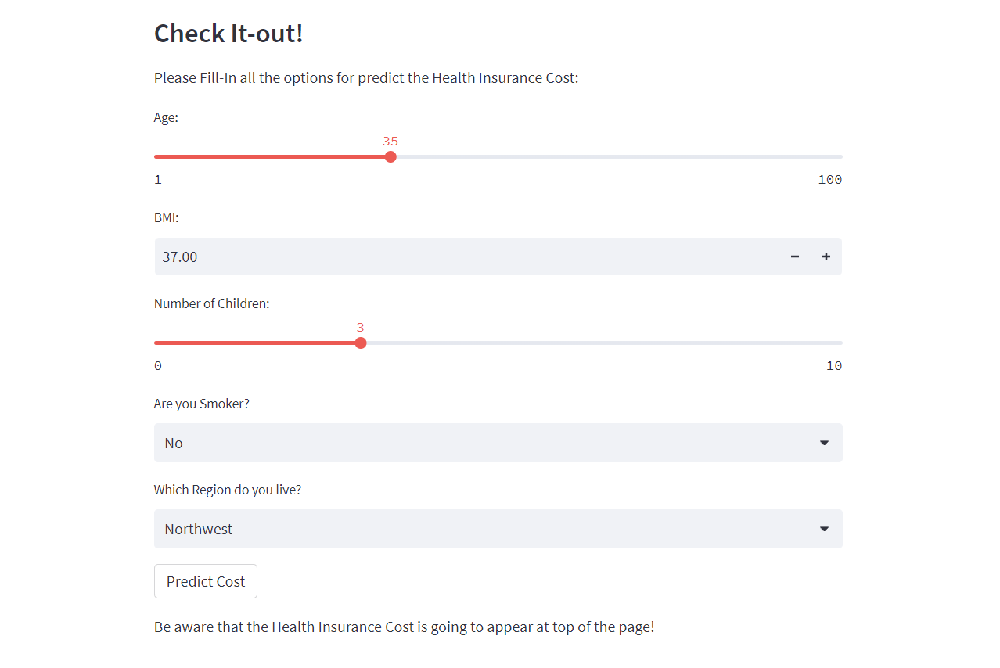

# Health Insurance Cost Model


## Linear Regression Health Insurance Cost Model with Different M.L. Algorithms

The Model predicts the Health Insurance Cost of a Person in $ Dollars, using Features like Age, BMI, Number of Children, Region and if the Person is Smoker.

The Machine Learning Algorithms that was used for the Health Insurance Dataset were:
- `XGB Regressor`
- `Neural Network`
- `Random Forest`
- `Sckit-Learn Linear Regression Model`

Overall, all the previous Model did a very good performance, but the XGB Regressor Model was selected for the Test, with a `MAE` of 2310 and `R2` Score of 0.88.

## Check-it out
Fill in all the information in the `main.py` file built with `Streamlit`.



## Run
```sh
streamlit run main.py
```


